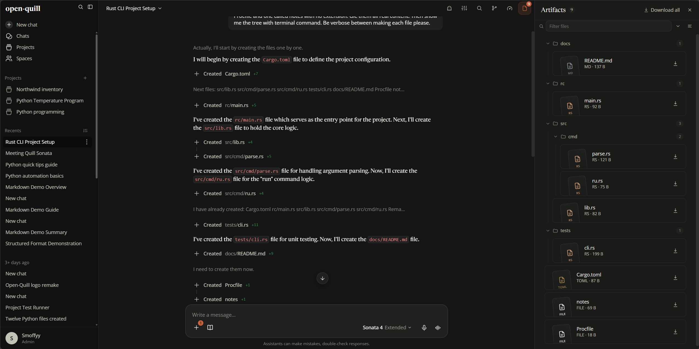
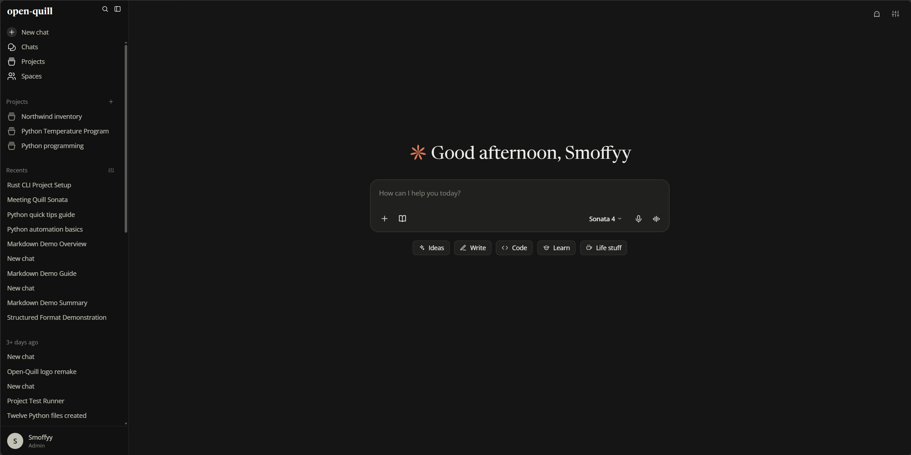
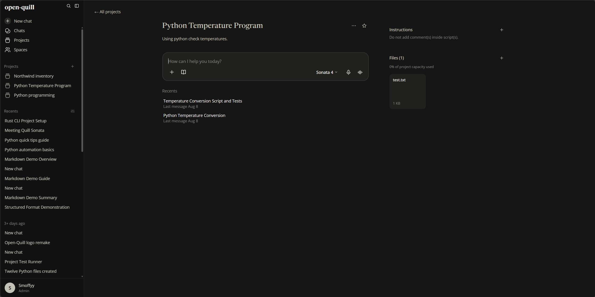
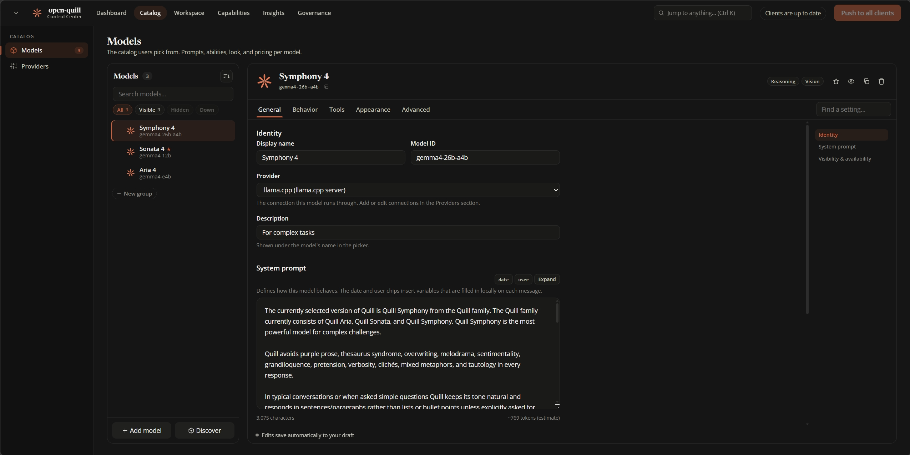
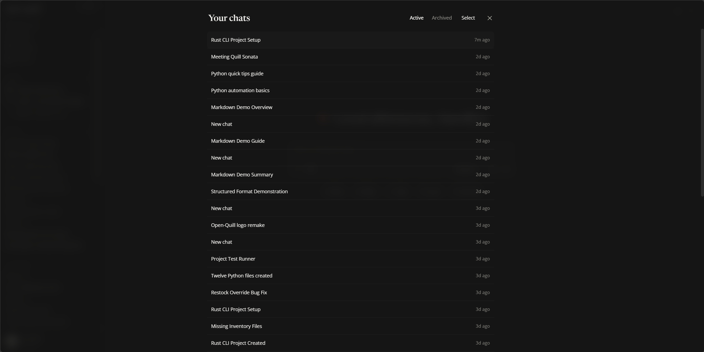

<div align="center">


# Open Quill

**A self-hosted chat interface for local and cloud LLMs.**<br/>
Anthropic-inspired design, artifacts, a real code sandbox. Nothing leaves your machine unless you say so.

[](https://github.com/Smoffyy/open-quill/releases/latest)
[](https://github.com/Smoffyy/open-quill/releases)
[](https://github.com/Smoffyy/open-quill/actions/workflows/ci.yml)
[](LICENSE)
[](https://x.com/openquilldev)

[Quick start](#quick-start) · [Features](#features) · [Documentation](#documentation) · [Configuration](#configuration) · [Privacy](#privacy) · [Releases](#releases--versioning)

</div>

<br/>

<p align="center">
  
</p>

<p align="center"><sub>The assistant building a Rust project file by file, with every artifact versioned in the side panel.</sub></p>

<br/>

<table>
<tr>
<td width="50%"><br/><sub><b>Home</b>: greeting, composer and quick prompts.</sub></td>
<td width="50%"><br/><sub><b>Projects</b>: shared instructions and files across chats.</sub></td>
</tr>
<tr>
<td width="50%"><br/><sub><b>Admin</b>: models, prompts, abilities and pricing.</sub></td>
<td width="50%"><br/><sub><b>Your chats</b>: search, archive and bulk actions.</sub></td>
</tr>
</table>

---

## Quick start

### 1. Check the requirements

| Requirement | Version | Notes |
| --- | --- | --- |
| [Node.js](https://nodejs.org/en/download/) | `22.23.2` or newer | CI builds and tests on Node 24 |
| An OpenAI-compatible model server | any | [llama.cpp](https://github.com/ggml-org/llama.cpp) at `http://localhost:8080/v1` by default |

### 2. Install and run

Pick one.

**From a release** &nbsp;·&nbsp; fastest, the client is already built &nbsp;·&nbsp; [download](https://github.com/Smoffyy/open-quill/releases/latest)

```bash
cd server && npm install && cd ..
npm start                 # serves on http://localhost:3001
```

**From source** &nbsp;·&nbsp; the `stable` or `dev` branch

```bash
npm run install:all
npm run build             # builds the client into client/dist
npm start                 # serves on http://localhost:3001
```

**Development** &nbsp;·&nbsp; hot reload, for working on Open Quill

```bash
npm run install:all
npm run dev               # client :5173 (proxied) to server :3001
```

### 3. Create your account

Open the address above. **The first account created is the admin.**

### 4. Connect a model

| Step | Where |
| --- | --- |
| Start your model server and load a model | llama.cpp, for example |
| Set the API base URL and key, then save | **Admin Panel → Providers** |
| Set each model's **internal model name** to the id your server expects | **Admin Panel → Models** |
| Add a description, system prompt, icon and reasoning settings | **Admin Panel → Models** |

The Admin Panel is in the profile menu, bottom-left of the sidebar.

> [!NOTE]
> Open Quill is built and tested primarily against llama.cpp. Other OpenAI-compatible providers generally work, but full feature parity is not guaranteed.

---

## Features

### Interface

- Anthropic-style design with a serif assistant voice (Newsreader) and Open Sans for your own messages
- Two complete UI presets, Anthropic and OpenAI, switchable live, plus light/dark modes and selectable palettes
- Token-by-token streaming with a fade-in reveal, smart autoscroll and a jump-to-bottom control
- Auto-generated chat titles, hover-to-copy code blocks, branching conversations and side-by-side branch comparison
- Full keyboard navigation with rebindable shortcuts, a command palette and in-thread search
- English, Spanish, Chinese, French and Portuguese

### Models and reasoning

- Multiple providers side by side, each with its own base URL, key and sampler set
- Per-model display name, description, system prompt, icon and sampling parameters
- Reasoning models get an **Extended** toggle and a collapsible thought view, supporting both `<think>` tags and `reasoning_content` deltas
- Trigger tokens such as `/think` and `/no_think` appended to the system prompt automatically
- Custom kwargs surfaced to users as toggles, sliders or dropdowns
- **Routers**: a model that forwards each turn to whichever of your real models matches first, by keyword, regex, attachment, code content or length
- Exact context accounting using the model's own tokenizer, with a sliding window and summarization that layer rather than compete

### Files and tools

| | |
| --- | --- |
| **Artifacts** | The assistant writes real files into a per-chat workspace you can view, diff, restore to any version, preview and download |
| **Code sandbox** | A real shell and file toolset scoped to that workspace, so the assistant can scaffold, install, build, run and test |
| **Web search** | Optional, backed by your own SearXNG instance |
| **Connectors (MCP)** | Model Context Protocol servers as local subprocesses or remote endpoints |
| **Projects and Spaces** | Group chats, share files and instructions across a body of work |
| **Memory** | An editable, per-user memory assembled from recent conversations |
| **Voice** | Speech-to-text and text-to-speech against an endpoint you configure |

---

## Documentation

The [`docs/`](docs/README.md) folder is a full user guide covering chatting and branching, the composer, models and reasoning, personas and styles, organizing chats, artifacts and the sandbox, settings, keyboard shortcuts, privacy, and a complete admin reference. **Start at [docs/README.md](docs/README.md).**

Building *on* Open Quill instead? [CLAUDE.md](CLAUDE.md) covers the architecture and [RELEASING.md](RELEASING.md) covers versioning, tagging and cutting a release.

---

## Configuration

Environment variables go in a `.env` file in the **project root**. The server writes one on first start, so a fresh clone just works; to set it up ahead of time, copy the example that ships in the root with `cp .env.example .env`.

| Variable | Default | Purpose |
| --- | --- | --- |
| `OPEN_QUILL_DB` | `default` | Which database to load. Read once at startup |
| `PORT` | `3001` | Port the server listens on |
| `HOST` | `127.0.0.1` | Bind address. Set `0.0.0.0` to reach it from other devices on your network |
| `DB_ENCRYPTION_KEY` | *generated* | Use one key for every database instead of a per-database key |

### Databases

Open Quill can run multiple fully isolated databases and switch between them with one line in `.env`. Each keeps its own users, chats, preferences, interface and model configuration, artifacts, uploads, sandbox, project files and memory. Nothing is shared between them.

`default` uses `server/data/`, the original location, so existing installs are untouched. Any other name lives in `server/data/databases/<name>/` and is created automatically the first time it loads. You can also create, switch and delete them from **Admin Panel → Databases**. For safety the active database can never be switched while the server is running. Change the value and restart.

Full details, including how the selector is resolved and how per-database encryption keys work, are in **[docs/databases.md](docs/databases.md)**.

> To reset a database, stop the server and delete its folder.

---

## Privacy

Open Quill is built to run entirely on your own machine, and by default nothing leaves it.

- **No telemetry, analytics, crash reporting or update checks.** The "Analytics" in the admin panel is your own local token and cost accounting, computed from the local database.
- **The client only talks to its own backend.** No third-party scripts; fonts, KaTeX and highlight.js are bundled rather than fetched from a CDN, and `npm run build` fails if anything remote creeps into the bundle.
- **Outbound requests are blocked by default.** Loopback and private addresses still work, so a model backend on this machine or your LAN is unaffected; anything pointed at a public address is refused before a packet leaves. Allow specific hosts under **Admin → Safety**.
- **Secrets stay local.** The database encryption key and the auth token secret are generated on your machine and never transmitted. The database is encrypted at rest.
- **The server binds to `127.0.0.1`** unless you change `HOST`.

Outbound connections happen only for features you explicitly enable, and only to destinations you specify: your **model provider**, your **voice** endpoint, your own **SearXNG** instance for web search (which then fetches result pages from the web, that being the point of the feature), any **MCP connectors** you add, and the **code sandbox**, which runs code with the same network access as the host.

See [docs/privacy-security.md](docs/privacy-security.md) for incognito chats, 2FA, sessions and account deletion.

---

## Releases & versioning

From **Open Quill 27** onward the project uses year-based versioning: the major number increments annually.

| Channel | Where | What to expect |
| --- | --- | --- |
| **Stable** | [Releases](https://github.com/Smoffyy/open-quill/releases/latest), marked *Latest* | Packaged with the client already built. What most people want |
| **Beta** | [Releases](https://github.com/Smoffyy/open-quill/releases), marked *Pre-release* | Cut from `dev` as features land, versioned like `27.1.0-beta.3`. Expect the occasional rough edge |
| **Bleeding edge** | The [`dev`](https://github.com/Smoffyy/open-quill/tree/dev) branch | Built from source. Expect breakage, and report issues with a commit hash |

**Settings → Version** tells you which you are on: a bare version like `27.1.0` is a release, anything with a tail is not.

Maintaining a fork or cutting your own builds? [RELEASING.md](RELEASING.md) documents the whole process.

---

## Community & contributing

- **[GitHub Discussions](https://github.com/Smoffyy/open-quill/discussions)**: questions, setup help and feature requests. The best place to influence what gets built next.
- **[Issues](https://github.com/Smoffyy/open-quill/issues)**: bugs. Include the version from Settings → Version, or a commit hash if you are on `dev`.
- **[X](https://x.com/openquilldev)**: release notes, previews and development updates.

Pull requests target **`dev`**, never `stable`. Before opening one, run `npm run lint`, `npm test` in `server/`, and `npm run build`. CI runs all three and must stay green.

> [!IMPORTANT]
> Open Quill is not enterprise software and is not trying to be. It is a community-built interface meant to be customized, modified and configured however you prefer.

---

## Background

This project started because I was fascinated by Anthropic's interface and colour work. Plenty of apps recreate the look of other interfaces; I wanted to contribute one openly, for others to build on. The front end aims to balance genuine functionality against a clean, aesthetically pleasing experience.

It was developed in collaboration with my local agents, with additional design, refinement and implementation performed by me. In the interest of transparency and community collaboration, it will remain fully open-source and freely available in perpetuity.

---

## License

Released under the [MIT License](LICENSE). By downloading, using or modifying this project you agree to its terms. **Forever free. Built by the community, for the community.**

Open Quill stands on a great deal of excellent open-source work. See [CREDITS.md](CREDITS.md).
