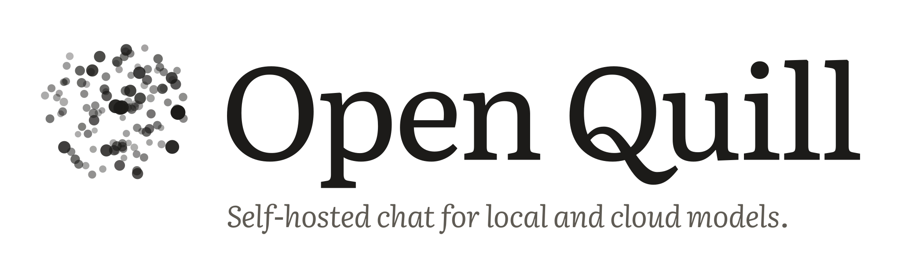
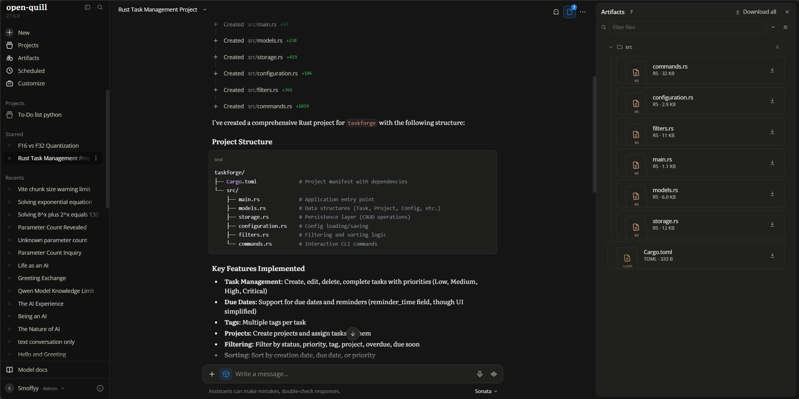
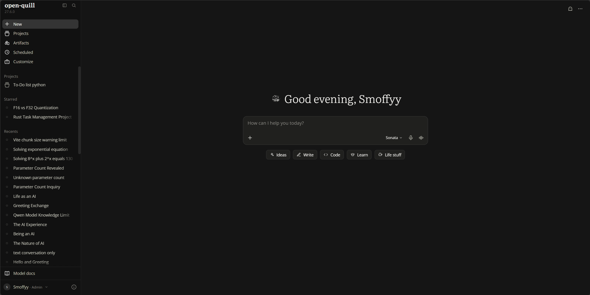
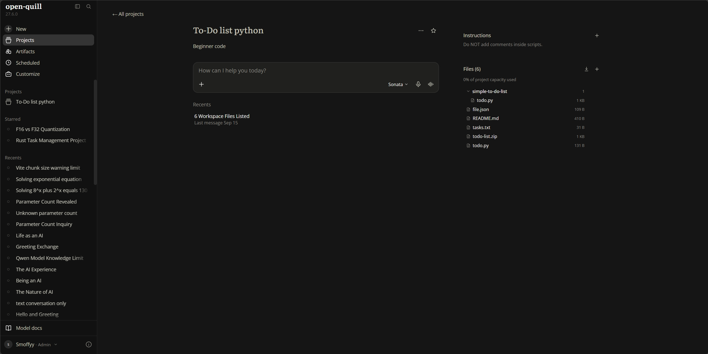
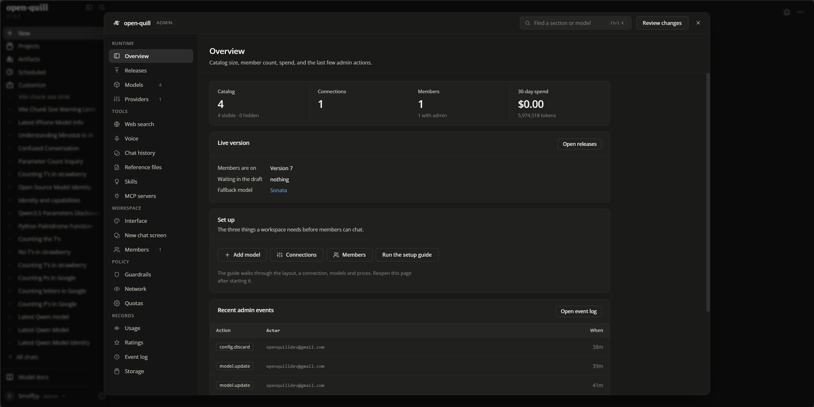

<br/>

<p align="center">
  <picture>
    <source media="(prefers-color-scheme: dark)" srcset="press-kit/lockup/lockup-horizontal-tagline-on-dark.svg">
    <source media="(prefers-color-scheme: light)" srcset="press-kit/lockup/lockup-horizontal-tagline-on-light.svg">
    
  </picture>
</p>

<p align="center">
  Your own chat app for language models. Runs on your machine, talks to the models you choose, keeps everything else to itself.
</p>

<p align="center">
  <a href="https://github.com/Smoffyy/open-quill/releases/latest"></a>
  <a href="https://github.com/Smoffyy/open-quill/actions/workflows/ci.yml"></a>
  <a href="LICENSE"></a>
  <a href="https://github.com/Smoffyy/open-quill/commits/dev"></a>
</p>

<br/>

## Up and running

```bash
git clone https://github.com/Smoffyy/open-quill.git
cd open-quill
npm run install:all
npm run build
npm start
```

Open **http://localhost:3001**, make an account (the first one is the owner), and point it at a model in **Admin Panel → Providers**. That is the whole setup.

You need [Node.js](https://nodejs.org/en/download/) 22.23.2+ and a model. Prefer not to build? Grab a [release](https://github.com/Smoffyy/open-quill/releases/latest), which ships with the client already built, and run `npm install` in `server/` followed by `npm start`.

<br/>

## A quick tour

<table>
<tr>
<td width="58%"></td>
<td width="42%" valign="middle">

### It does real work

The assistant gets a sandbox per chat: a file system and a shell. It can scaffold a project, install packages, run the build and fix what breaks. Every file it touches shows up in the artifacts panel with its full history, so you can diff, roll back, preview or download.

</td>
</tr>
<tr>
<td width="42%" valign="middle">

### It looks the part

Two complete interface styles, one in the spirit of Claude and one in the spirit of ChatGPT, switchable live. Light and dark, a handful of palettes, and a theme builder when you want to go further. Available in ten languages.

</td>
<td width="58%"></td>
</tr>
<tr>
<td width="58%"></td>
<td width="42%" valign="middle">

### It keeps your work together

Projects group chats around shared instructions and files. Add memory, scheduled tasks, web search through your own SearXNG, and MCP connectors for anything else.

</td>
</tr>
<tr>
<td width="42%" valign="middle">

### It is built for more than one person

Accounts with roles. Admins tune models, prompts and tools in a shared draft, test them in the playground, then ship them as a numbered release that can be rolled back. Members never see a half-finished change.

</td>
<td width="58%"></td>
</tr>
</table>

<br/>

## Works with

**On your machine:** llama.cpp · Ollama · LM Studio · vLLM

**In the cloud:** OpenAI · Anthropic · Google Gemini · OpenRouter · Mistral · Moonshot (Kimi) · Meta Llama API

A llama.cpp provider at `http://localhost:9931` is configured on first start. Anything else is a few clicks in **Admin Panel → Providers**.

<br/>

## Questions people ask

<details>
<summary><b>I have never self-hosted anything. Is this for me?</b></summary>
<br/>

Yes, if you can install Node.js and paste five commands into a terminal. Open Quill is a website that runs on your own computer instead of someone else's server. You open it in your browser like any other site, it just lives at `localhost`. The [Getting Started guide](docs/getting-started.md) walks through the first run step by step.

</details>

<details>
<summary><b>Does it come with a model?</b></summary>
<br/>

No. Open Quill is the interface, the model is separate. The easiest local options are [Ollama](https://ollama.com) or [llama.cpp](https://github.com/ggml-org/llama.cpp). If your machine is not up for running models, use a cloud API key instead.

</details>

<details>
<summary><b>Why can't it reach my cloud API?</b></summary>
<br/>

Outbound requests to public addresses are blocked by default so nothing leaves your machine by accident. Allow the provider's host in **Admin Panel → Network** and it will connect. Local and LAN addresses are never blocked.

</details>

<details>
<summary><b>Is anything sent anywhere?</b></summary>
<br/>

Only what you set up. There is no telemetry, no analytics, no update check and no third-party script; fonts and libraries are bundled, and the build fails if that ever changes. The database is encrypted with a key generated on your machine. Traffic goes out only to the model provider, voice endpoint, search instance and MCP connectors you configure, plus whatever the code sandbox runs. Full details in [Privacy & Security](docs/privacy-security.md).

</details>

<details>
<summary><b>Can other people in my house or team use it?</b></summary>
<br/>

Set `HOST=0.0.0.0` in `.env` and restart, then they can open it at your machine's local IP. Turn on **Accept new sign-ups** in **Admin Panel → Members** so they can create accounts, then set their roles there. Roles go member, editor, publisher, owner, and you can only manage roles below your own.

</details>

<details>
<summary><b>How do I update?</b></summary>
<br/>

Download the new release, or on a clone run `git pull`, `npm run install:all` and `npm run build`. **Settings → Version** shows what you have. The `dev` branch gets changes first if you want them early; report bugs from it with a commit hash.

</details>

<details>
<summary><b>How do I start over?</b></summary>
<br/>

Stop the server and delete the database folder (`server/data/` for the default one). You can also run several fully separate databases side by side and switch with `OPEN_QUILL_DB` in `.env`. See [Databases](docs/databases.md).

</details>

<br/>

## Under the hood

For anyone who wants to read or change the code.

| | |
| --- | --- |
| **Server** | Node.js, Express 5, SQLCipher-encrypted SQLite, WebSocket streaming |
| **Client** | React 19, Vite |
| **Model protocols** | OpenAI-compatible, Ollama, Anthropic (official SDK) |
| **Tests** | `node --test`, with a real-server HTTP suite and strict provider mocks |

```
open-quill/
├── server/     API, database, auth, sandbox, model pipeline
├── client/     React app
├── docs/       user guide
└── release/    release notes per version
```

| Command | |
| --- | --- |
| `npm run dev` | Server on `:3001` and client on `:5173`, both hot reloading |
| `npm run build` | Build the client and check nothing in it reaches off-origin |
| `npm start` | Run the production server |
| `npm run lint` | ESLint across the repo |
| `cd server && npm test` | Server test suite |

Environment variables (`PORT`, `HOST`, `OPEN_QUILL_DB`, `DB_ENCRYPTION_KEY`, `TRUST_PROXY`) are documented in [`.env.example`](.env.example). The architecture, conventions and release process are in [AGENTS.md](AGENTS.md).

<br/>

## Get involved

- **Ask or suggest** in [Discussions](https://github.com/Smoffyy/open-quill/discussions)
- **Report a bug** in [Issues](https://github.com/Smoffyy/open-quill/issues), with your version from Settings → Version
- **Send a PR** against `dev`, never `main`, with lint, build and tests passing

Open Quill started from admiration for Anthropic's interface and color work and a wish to have an open version of it anyone could build on. It is meant to be forked, restyled and bent to your own taste, and it will stay free.

<br/>

<p align="center">
  <a href="docs/README.md">Documentation</a> · <a href="CHANGELOG.md">Changelog</a> · <a href="CREDITS.md">Credits</a> · <a href="LICENSE">MIT License</a>
</p>